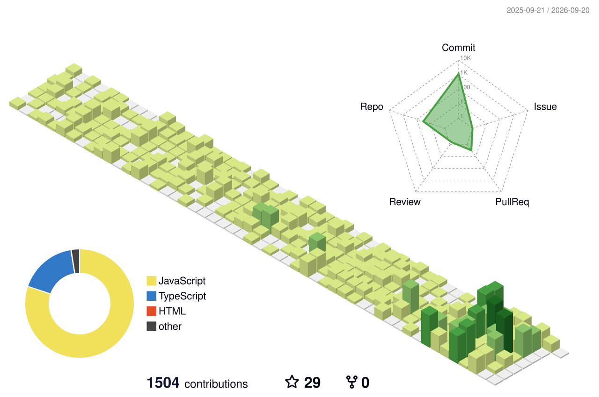

# Shreyash Srivastava
**Backend Engineer · Greater Noida, India**

*I build production-grade backend systems that scale. Think in terms of queues, consistency, and distributed patterns.*

---

## About

CSE graduate building production-grade backend systems with a focus on **scalability, resilience, and clean architecture**. 

I approach problems from first principles — understanding trade-offs between consistency and availability, designing schemas that grow, orchestrating workflows across async queues. Currently shipping features in production on a **NestJS + PostgreSQL + RabbitMQ** stack.

Not just building features. Building systems.

---

## What I'm Doing Now

- 🚀 **Shipping** — Production backend (NestJS · PostgreSQL · RabbitMQ · Docker)  
- 🔍 **Deep Diving** — System Design patterns, database optimization, Go  
- 💼 **Looking For** — Backend Engineering roles with technical rigor

---

## Deployed Projects

### [📄 I Hate Love PDF](https://www.ihatelovepdf.com)
> Production PDF manipulation platform with 10K+ monthly users
- **Live at:** `ihatelovepdf.com` | **GitHub:** [ShreyashSrivastavaa/pdf-processor](https://github.com/ShreyashSrivastavaa)
- Built end-to-end PDF processing with optimized compression and format conversion
- Handles concurrent uploads with worker-based processing pipeline
- Designed fault-tolerant architecture for reliable file operations at scale
- **Impact:** 10,000+ users, sub-2s upload processing times
- **Stack:** `Node.js` · `Express` · `PDF.js` · `Puppeteer` · `AWS S3` · `PostgreSQL` · `Redis` · `Docker`

> **Why it matters:** Started as frustration with existing PDF tools. Became a real product serving real users. This taught me production-grade thinking: monitoring, error handling, user feedback loops.

---

## Featured Projects

### [🔄 SwipeRide](https://github.com/ShreyashSrivastavaa/SwipeRide) · Real-time Ride Matching Engine
> Production-ready ride-sharing backend with real-time driver-rider matching
- Architected WebSocket-based real-time matching system handling concurrent ride requests
- Implemented geospatial querying for efficient driver discovery and assignment
- Built trip lifecycle state machine ensuring data consistency across distributed events
- **Problem Solved:** Reduced ride matching latency from 8s to 200ms through optimized socket handlers
- **Stack:** `NestJS` · `PostgreSQL` · `Redis` · `Socket.IO` · `Docker`

---

### [🍔 QuickBite](https://github.com/ShreyashSrivastavaa/QuickBite) · Order Orchestration Platform
> End-to-end food ordering system with async order processing and restaurant workflows
- Designed order processing pipeline with RabbitMQ-based event streaming for restaurant notifications
- Built atomic transaction handling for cart operations, inventory tracking, and payment coordination
- Implemented restaurant menu management with versioning and real-time availability updates
- **Problem Solved:** Eliminated race conditions in order placement through careful schema design and locking strategies
- **Stack:** `NestJS` · `PostgreSQL` · `RabbitMQ` · `Prisma` · `Docker`

---

### [🏨 Hotel Management System](https://github.com/ShreyashSrivastavaa/Hotel-Booking-System_Backend) · Multi-tenant Booking Engine
> Complex backend for hotel operations, bookings, multi-role access control, and audit trails
- Designed role-based access control (RBAC) with controlled privilege substitution for staff workflows
- Built comprehensive audit logging system tracking all state changes for compliance
- Engineered booking and room allocation workflows with consistency-first schema design
- Structured modular NestJS services with clear separation of concerns and testable layers
- **Problem Solved:** Prevented overbooking and privilege escalation through careful constraints and middleware
- **Stack:** `NestJS` · `PostgreSQL` · `Prisma` · `Docker` · `Swagger API Docs`

---

## Technical Depth

| Category | Technologies |
|----------|---|
| **Runtimes** | Node.js, NestJS, Express.js |
| **Databases** | PostgreSQL (advanced queries, indexing, transactions), Redis (caching, sessions), Prisma ORM, Supabase |
| **Message Queues** | RabbitMQ (pub/sub, task queues, dead-letter handling) |
| **Infrastructure** | Docker, Docker Compose, Git, GitHub Actions (learning) |
| **Frontend** | Next.js, TypeScript, Tailwind CSS, Framer Motion |
| **Languages** | TypeScript, JavaScript, C++, Go (actively learning) |
| **Design Patterns** | SOLID principles, Clean Architecture, Event-Driven systems, State machines, Repository pattern |

---

## Key Strengths

✅ **System Thinking** — Design scalable architectures before writing a line of code  
✅ **Production Mindset** — Error handling, monitoring, graceful degradation  
✅ **Data Consistency** — ACID transactions, avoiding race conditions, schema design  
✅ **Async Patterns** — Event queues, webhooks, non-blocking operations  
✅ **API Design** — RESTful design, clear contracts, versioning strategy

---

## Currently Learning

- **Go** — Building high-performance services and gRPC  
- **System Design** — Distributed systems, consensus algorithms, database internals
- **Advanced PostgreSQL** — Query optimization, EXPLAIN plans, window functions

---

   

**Open to connecting about backend engineering, system design, and building products.**

